# Erdos_1197



This graph shows the repair slice from the imported PNT facts to the former single gap
`bm_approx_data`.

Pink nodes are imported or preexisting boundary dependencies outside our contribution. Gray nodes are local
theorems and lemmas we contributed. The green node is the resolved former gap
`bm_approx_data`.

The graph is theorem-focused: it shows the named local proof components that materially
feed `bm_approx_data`. Plain definitions and very small algebraic side lemmas are omitted
so the graph stays readable.

To run the project:
```powershell
lake exe cache get
lake build
```
